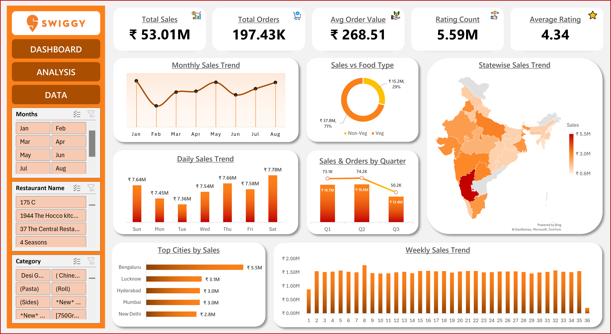

# 📊 Swiggy Sales Analytics Dashboard (Excel)

An end-to-end **Sales Analytics Dashboard built in Microsoft Excel** to analyze Swiggy’s sales performance across multiple dimensions such as time, geography, category, restaurant, and food type.

This project demonstrates how **Excel can be used as a powerful business analytics and visualization tool** to convert raw transactional data into clear, decision-ready insights.

---

## 🖼️ Dashboard Preview

---

## 📌 Project Overview

Food delivery platforms like Swiggy generate massive volumes of order data, but raw data alone does not help in decision-making.

This dashboard is designed to help business and operations teams:

- Track overall sales performance
- Identify growth trends and seasonality
- Compare performance across cities and states
- Understand customer ordering behavior and preferences
- Analyze category and restaurant-level contribution

---

## 🎯 Business Problem

Management teams need a **single, interactive view** to answer questions like:

- How are sales trending over time?
- Which cities and states are driving the most revenue?
- Which categories and food types perform best?
- What are the peak ordering days and periods?
- Which restaurants and locations contribute the most?

This dashboard solves that by:

- Converting raw sales data into **actionable insights**
- Providing **management-level KPIs at a glance**
- Enabling **drill-down analysis using interactive filters**

---

## 📊 Key KPIs Tracked

- Total Sales
- Total Orders
- Average Order Value (AOV)
- Rating Count
- Average Rating

---

## 📈 Dashboard Capabilities

- Monthly, Weekly, Daily & Quarterly sales trend analysis
- City-wise and State-wise sales performance (Map visualization)
- Veg vs Non-Veg revenue contribution analysis
- Top cities by sales ranking
- Day-wise ordering pattern analysis
- Fully interactive dashboard using slicers for:
  - Month
  - Restaurant
  - Category

---

## 🛠️ Tools & Techniques Used

- Microsoft Excel
- Pivot Tables & Pivot Charts
- Slicers & Timeline Filters
- Conditional Formatting
- KPI Cards & Dynamic Charts
- Excel Map Chart for geographic analysis

---

## 💡 Key Insights Generated

- Identifies **top-performing cities and regions**
- Highlights **peak sales periods and seasonal trends**
- Shows **which food categories and types drive maximum revenue**
- Helps understand **weekly and daily demand patterns**
- Enables data-driven decisions for marketing and operations planning

---

## 📁 Files in This Repository

- `Swiggy_Sales_Dashboard.xlsb` – Main interactive Excel dashboard  
- `Swiggy_Dashboard_Preview.png` – Dashboard preview image  
- `README.md` – Project documentation  

---

## 🚀 How to Use

1. Download `Swiggy_Sales_Dashboard.xlsb`
2. Open in Microsoft Excel (Desktop version recommended)
3. Use slicers to filter by:
   - Month
   - Restaurant
   - Category
4. Explore trends and insights dynamically across the dashboard

---

## 🎯 What This Project Demonstrates

- Strong Excel-based data analysis skills
- Business-oriented dashboard design
- Data storytelling using charts and KPIs
- Ability to convert raw data into management-ready insights
- Understanding of sales, operations, and performance analytics

---

## 👤 Author

**Divyadeep Jakhar**  
MBA (Marketing & HR)  
Aspiring Business Analyst  

🔗 LinkedIn: https://www.linkedin.com/in/divyadeep-jakhar/
